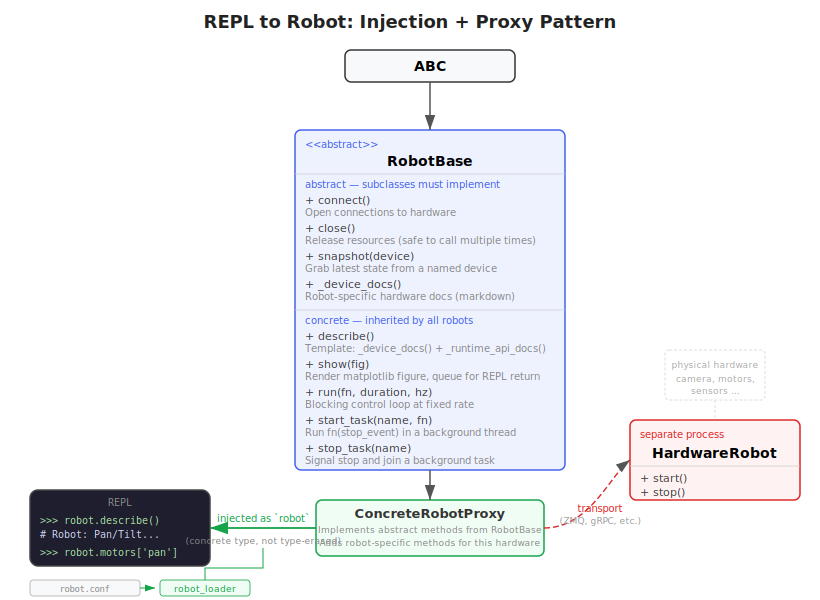

# Ariel Architecture

## Core Idea

Ariel treats an LLM as a programmer operating a live robotic software environment.
The model does not just pick from a predefined command set. It writes Python, runs it against
real sensors and actuators, inspects the results, and iterates.

The low-latency control loop is not the model. It is the code the model writes.

This is the key architectural move:

- slow reasoning stays with the LLM
- fast sensing and actuation stay local to the robot
- the interface between them is an interactive, persistent programming environment

## Why This Architecture

Three common failure modes in LLM robotics systems are:

1. The API is too rigid.
The model can only do what the command surface anticipated ahead of time.

2. The model writes code, but a human has to run it.
That removes the feedback loop that makes LLMs useful in the first place.

3. The model sits in the live control loop.
That couples real-time behavior to network and model latency.

Ariel avoids these by separating concerns:

- the LLM writes, debugs, and revises code
- the robot executes that code locally
- the MCP layer carries intent and observations, not every sensor sample

## Three-Process Model

### 1. Hardware Server

[`robots/pantilt/hardware.py`](robots/pantilt/hardware.py)

This process owns the physical hardware. For the current robot, that means:

- a USB camera
- two Dynamixel motors

It publishes state over ZMQ and receives motor commands over ZMQ.

This process is intentionally specific to one concrete robot and one concrete host setup.
That is acceptable here. Ariel is currently a reference implementation, not a polished generic
robot deployment framework.

### 2. MCP Server

[`server/mcp_server.py`](server/mcp_server.py)

This process exposes the system to an LLM client over MCP. It is responsible for:

- serving the MCP endpoint
- managing the REPL subprocess lifecycle
- presenting tools such as `describe`, `execute`, and `snapshot`
- translating images and execution results back into MCP content blocks

This layer is mostly robot-agnostic.

### 3. REPL Subprocess

[`server/repl_server.py`](server/repl_server.py)

This process hosts a persistent Python session with a preloaded `robot` object.
Model-authored code runs here.

It is deliberately expendable. If generated code crashes, the hardware process should remain
alive and the MCP server should be able to restart the REPL quickly.

## Crash Tolerance

Process isolation is one of the central design choices in Ariel.

The hardware process should be stable and long-lived.
The REPL process should be easy to kill and restart.

That matters because model-authored code is exploratory by nature:

- it raises exceptions
- it may wedge imported libraries
- it may leave globals or partial state behind

By isolating the REPL:

- a bad experiment does not require reinitializing cameras or serial devices
- the MCP server can recover automatically
- the LLM can continue working after a restart, with the clear understanding that REPL state was lost

## The `robot` Abstraction

The REPL exposes a `robot` object rather than direct raw transport primitives.
That object gives the model a structured surface for:

- reading camera frames
- reading and commanding motors
- running short blocking loops
- starting and stopping background tasks
- logging data
- returning plots and rendered images
- introspecting the available hardware

The important property is that safety and hardware conventions live below the LLM-authored code
where possible. For example, motor commands are clamped before they are sent to the actual motors.

  

## Robot-Agnostic Structure

The runtime is split between generic infrastructure and robot-specific implementation:

- [`server/robot_base.py`](server/robot_base.py) defines the base contract
- [`server/robot_loader.py`](server/robot_loader.py) loads the configured robot implementation
- [`robot.conf`](robot.conf) names the active robot class
- [`robots/pantilt/robot.py`](robots/pantilt/robot.py) implements the current robot proxy

That means the overall runtime can support other robots later, but this repository should still be
read honestly: the current hardware code is for one pan/tilt robot, not for arbitrary robots.

## Data Locality

One of the practical design principles in Ariel is to keep data on-device whenever possible.

Large sensor outputs usually should not be copied into the model context unless necessary.
Instead, the model should send code to:

- compute a summary
- extract features
- fit or filter data
- render a plot
- return just the result

This is both cheaper and operationally cleaner than using MCP as a bulk telemetry channel.

## Tooling Surface

The MCP tool surface is intentionally small:

- `health`
- `describe`
- `execute`
- `snapshot`
- `shell`
- `save_module`
- `list_modules`
- `read_module`

That is enough to support an iterative programming workflow without forcing every future behavior
into a giant predefined command API.

## Modules As Working Memory

The `modules/` directory acts as a persistence layer for useful code discovered during interaction.
The model can prototype in the REPL, then save stable pieces into reusable modules.

This is important architecturally because it lets the system accumulate code, not just transient
conversation state.

## Scope

Ariel is not itself a robotics middleware, and it does not particularly care what middleware sits underneath it. You can use `roboflex`, or ROS, or a simulator, or some custom hardware interface; as long as sensors and actuators can be exposed to Python, Ariel can sit on top of it. 

Ariel is meant to be an LLM runtime for general robot intelligence.

Traditionally, everything above hardware gets built out as a tower of hand-authored software: behavior libraries, perception pipelines, task-specific APIs, helper abstractions, autonomy scaffolding, and increasingly elaborate Vision-Language-Action models. Some of that is useful. But much of it exists because, historically, the intelligence could not simply be handed the robot and asked to program it.

Ariel exists to test the proposition that much of this stack does not need to be pre-authored at all; it can be written on demand by the model, in context, against the robot itself.
