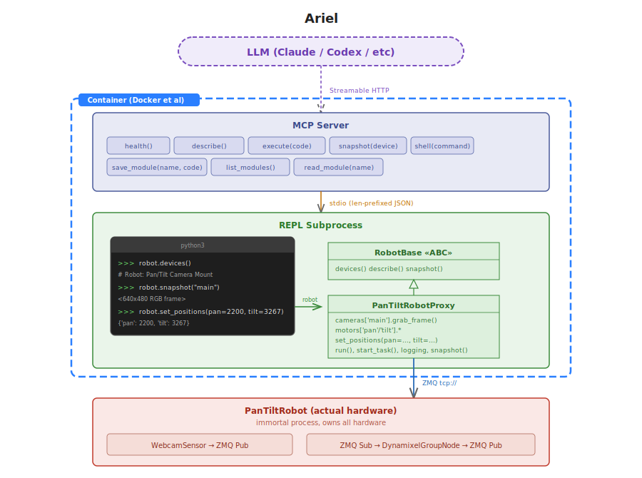
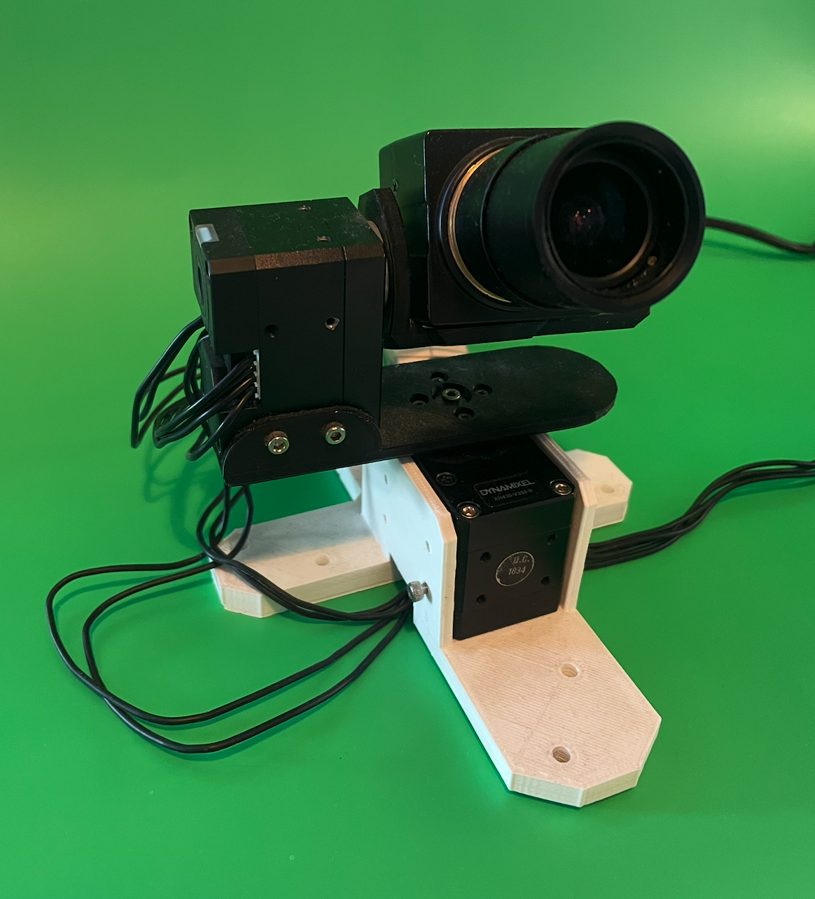
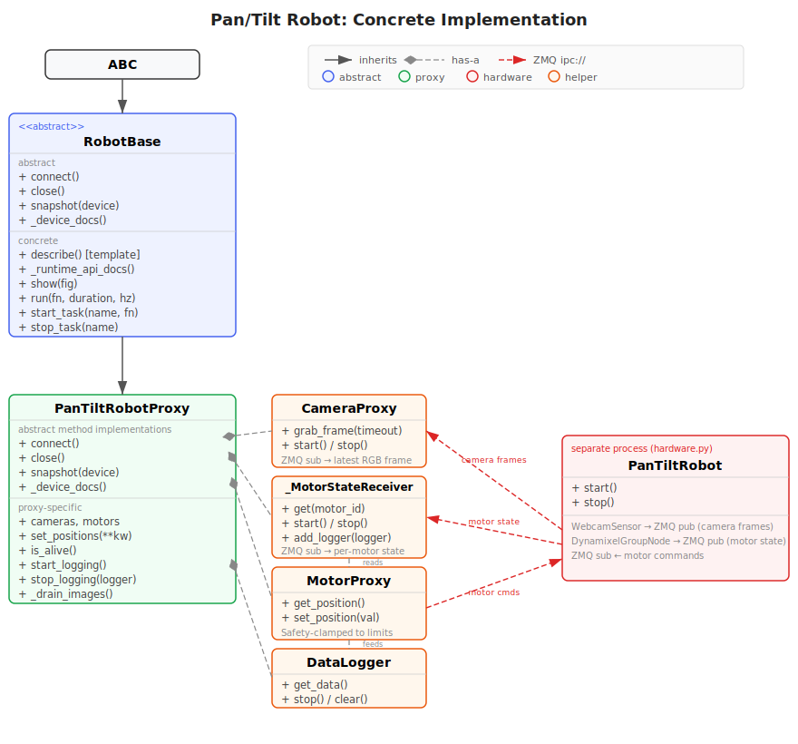

# Ariel

An MCP-driven REPL for direct robot control by LLMs.

## What This Is

So far, the single most impressive ability of contemporary LLMs is their ability to write code.
Why not lean into that for robotics?

This project is an experiment in giving LLMs direct control of a physical robot via a repl over MCP. Instead of using control mechanisms such as VLAs: Vision-Language-Action Models, trained on lots of data, to guide the robot for certain tasks, we simply use VLCs: Vision-Language-Code Models. Which is what LLMs already are - no additional training required. We give LLMs a way to **write, run, and revise control code live**, in the loop, on real sensors and actuators, under real constraints.

If a robot is a machine in space, then its intelligence is a machine in time: hypotheses, loops,
corrections, retries.

So the claim here is simple and sharp: the model should program the robot, not merely imitate its
shadows.

Ariel is a reference implementation of that idea using:

- a real physical robot backend - in this case a Pan-Tilt camera. This implementation uses `roboflex` as middleware, but the same effect can be achieved with ROS or any other robotics middleware / hardware control system. Or, indeed, simulators. But where's the fun in that?
- a persistent Python REPL with a preloaded `robot` object
- an MCP server exposing that environment to an LLM client

For the deeper design rationale, see [ARCHITECTURE.md](ARCHITECTURE.md).



## Why This Approach

Most LLM robotics integrations fall into one of three buckets:

- a narrow command API that must constantly be extended
- generated code that a human has to manually run
- high-latency LLM calls sitting directly in the control loop

Ariel takes a different approach:

- the LLM reasons slowly
- the code it writes runs fast, locally, on the robot
- data stays on-device unless a summary, result, or image needs to come back

That gives the model a real programming workflow: inspect, hypothesize, run, observe, revise.

## How It Works

Ariel has three main processes:

1. `robots/pantilt/hardware.py`
Owns the actual hardware for this specific robot: USB camera and Dynamixel motors.

2. `server/mcp_server.py`
Runs the MCP server and exposes tools like `describe`, `execute`, and `snapshot`.

3. `server/repl_server.py`
Runs a persistent Python session with a preloaded `robot` object and executes model-authored code.

The REPL process is deliberately expendable. If model-authored code crashes, the hardware server
keeps running and the MCP server can restart the REPL.

## Current Robot

<p align="center">
  
</p>


This codebase currently targets one specific robot:

- one USB camera
- two Dynamixel motors in a pan/tilt mount

The current `PanTiltRobot` is intentionally minimal. It does not contain built-in behaviors, task logic, navigation, grasping, detection pipelines, or any higher-level notion of what the robot is "for". It just exposes direct access to sensors and actuators through a simple `robot` object, and a `description` of what it is.

<p align="center">
  
</p>

Ariel is not built around the idea that every new robot needs a large hand-authored action API, a library of prebuilt skills, or retrained policies. The bet is that an LLM can adapt in context to a new robot if you give it:

- direct access to the robot's sensors and actuators
- a persistent REPL in which it can write and run code
- a clear textual description of the robot's hardware and conventions

In other words, the robot backend should be thin. The intelligence should come from the model writing code against that backend, not from a giant pile of pre-authored middleware.


### Run Your Own Robot

Supporting a different robot should be straightforward for exactly this reason: the robot-specific layer is small.

To add another robot, implement a subclass of `RobotBase`, expose whatever sensors and actuators you want the model to use, implement the small required interface, and point `robot.conf` at that class. The MCP server and REPL do not need to know whether the robot is a pan/tilt camera, a mobile base, an arm, or something in simulation.

What Ariel expects from a robot backend is intentionally minimal:

- `connect()` to initialize hardware or transport connections
- `close()` to shut them down cleanly
- `snapshot(device_name)` to return a quick view of a named sensor or actuator
- `_device_docs()` to describe the robot clearly to the model

Everything else is meant to be programmed by the model in context.

No retraining should be required.
No hand-authored "go here", "find the people", or "pick up the cup" primitives should be required.
No prebuilt vision or action logic should be required beyond whatever raw hardware access your robot needs.

The model should be able to inspect the robot, understand its interface from the docs, and then just program it.


## Repo Layout

- `server/` — generic MCP server, REPL subprocess, robot loader, base robot interface
- `robots/pantilt/` — robot-specific hardware process, proxy, and config
- `modules/` — user/model-authored Python modules saved from the REPL
- `tests/` — integration tests and test clients
- `docker-compose.yml` — recommended topology for MCP in Docker and hardware on host
- `Dockerfile` — image for the MCP/runtime container

## Install

Prerequisites:

- Python 3.11+
- a virtualenv at `.pyvenv/`
- GStreamer and SDL2 on the host
- a connected USB camera
- connected Dynamixel motors

Host setup:

```bash
source .pyvenv/bin/activate
pip install -r requirements.txt
```

For the Docker MCP setup, the image uses `requirements-mcp.txt`.

## Running

### Option A: Host hardware + Docker MCP

Run hardware on the host:

```bash
source .pyvenv/bin/activate
python -m robots.pantilt.hardware
```

Then start the MCP server in Docker:

```bash
docker compose up -d --build mcp
```

Logs:

```bash
docker compose logs -f --no-color mcp
tail -f logs/ariel_repl.log
```

### Option B: Fully host-native

```bash
source .pyvenv/bin/activate
python -m robots.pantilt.hardware
```

In a second terminal:

```bash
source .pyvenv/bin/activate
python -m server.mcp_server
```

## Connecting an MCP Client

Endpoint:

```text
http://127.0.0.1:8750/mcp
```

Quick probe:

```bash
curl -i http://127.0.0.1:8750/mcp
```

## MCP Tools

| Tool | Purpose |
|------|---------|
| `health` | Check server and REPL health, including whether REPL state is fresh |
| `describe` | Return robot description, API reference, and usage guidance |
| `execute(code)` | Run Python in the persistent REPL with `robot` preloaded |
| `snapshot(device)` | Return a camera image or motor state |
| `shell(command)` | Run shell commands in the REPL environment |
| `save_module(name, code)` | Save a reusable Python module to `modules/` |
| `list_modules()` | List saved modules |
| `read_module(name)` | Read a saved module |

## Typical Workflow

1. Call `health()` to verify the server and learn whether the REPL is fresh or stale.
2. Call `describe()` to discover devices, APIs, limits, and conventions.
3. Call `snapshot('main')` to inspect the current scene.
4. Use `execute(...)` to write and refine behavior.
5. Save stable code to `modules/` with `save_module(...)`.

## Notes

- Camera frames are RGB, not BGR.
- When moving pan and tilt together, prefer `robot.set_positions(...)`.
- `modules/` is runtime state. It is intended to accumulate model-authored code during use.

## Safety

- Motor commands are clamped to configured limits.
- Keep a clear physical workspace.
- Keep a human supervising live motion.
- Treat `execute` and `shell` as high-trust capabilities.
- Do not expose this server to untrusted networks.

## Troubleshooting

- No camera found: run `python -m robots.pantilt.tools.discover_cameras`
- Motors not responding: run `python -m robots.pantilt.tools.discover_motors`
- MCP client cannot connect: verify the server is reachable at `http://127.0.0.1:8750/mcp`
- REPL crashes: the MCP server will restart it, but prior REPL state is lost
