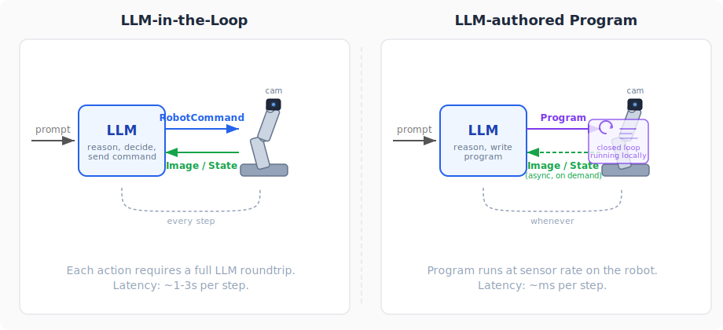
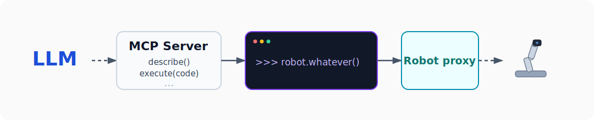

# Ariel, an MCP-exposed REPL for direct robot control by LLMs.

*LLMs show impressive ability to directly control a robot.*

I gave an LLM direct, programmatic, REPL-enabled access to a robot. LLMs are great at programming, so I let them program a robot in real time. This is why, how, and what happened.

<p align="center">
<video src="assets/hand_tracking_1.mp4" controls width="600px"></video>
<br>
<em>"Hey Gemini, could you use the Ariel MCP server to track a hand in real time?"</em>
</p>


## Why

Most current SOTA robotics systems are built on large training datasets, generated by human teleoperation or lots of simulation rollouts. And: these systems are often for just one robot. This makes them expensive to build and hard to generalize to new hardware.

The most impressive ability of contemporary AI is not predicting the next motor torque, or mapping pixels to actions, but the ability to write code. So, what if we just lean into that? Instead of VLAs - Vision Language Action models, I propose VLCs - Vision Language Code models. Which all top-tier LLMs already are.

In this conception, the LLM is the programmer, operating in-situ on a real robot, in real time, with real constraints and the real environment.

The LLM might query cameras or sensors, and then execute a series of robot/joint commands that it creates with a `for` loop in a program against a robot proxy. It can repeat this at will - an LLM in a closed loop. It can also author local closed-loop programs that react in real-time to the environment - after all, it can write programs that use pytorch, segment camera images, process tactile data, and run their own little policies.

<p align="center">

</p>

## How

This system, at [https://github.com/colinator/Ariel](https://github.com/colinator/Ariel), gives an LLM direct access to a robot through a Python REPL it can submit code to. The exact physical robot can be easily substituted.

At the top level, there are three pieces:

- an MCP server that exposes tools like `describe()` and `execute(code)`
- a persistent REPL subprocess, which behaves like a normal Python session and keeps state across calls
- a robot proxy injected into that REPL as `robot`

<p align="center">

</p>

That `robot` object is the bridge to the actual hardware. In this case, it sends commands and receives state over zmq/tcp to a separate hardware process running on the host. The same basic pattern could sit on top of ROS or any other robotics middleware just as well.

So the model is not choosing from a fixed menu of robot commands. It is writing Python against a live robot object, running that code, inspecting the result, and revising it. It can define helpers, build up state, save modules, install dependencies, and in general use the robot the way a human developer would use a REPL.

I run the MCP server and REPL subprocess inside a Docker container for damage control, while joint limits are still enforced on the hardware side.

<p align="center">

</p>

I used an extremely simple robot: just a couple of dynamixel motors arranged in a pan-tilt configuration, holding a usb camera.

The hardware robot and the proxy were written using [roboflex](https://github.com/flexrobotics), and communication between docker and the hardware process was over zmq/tcp. The same can be done with ROS or any other appropriate robotics middleware.


## What happened
	
So far, LLMs (I tested Codex, Claude, and Gemini) have shown impressive ability to query the hardware, understand it, pull and understand images from the cameras, and point the camera at different things. More impressively, they've also shown the ability to write real-time control loops, such as 'follow my face' or 'follow my hand'. At first this looked like one-shotting, but closer inspection showed something more interesting: even inside one user prompt request, the models were still taking multiple reasoning steps and repeatedly using the REPL.

### Example: Gemini writes a hand-tracker

At one point, Gemini was asked to track a hand in real time. There was no prebuilt `track_hand()` tool for it to call. Instead, it checked for `mediapipe`, wrote a little vision-and-control loop in the REPL, and ran it directly against the live camera and motors.

```text
>>> pip install mediapipe
Requirement already satisfied: mediapipe ...
>>> import mediapipe as mp
>>> def track_hand_step(robot):
...     ...
>>> robot.run(track_hand_step, duration=15.0, hz=15)
Starting hand tracking for 15 seconds...
Tracking finished.
```

The actual loop it wrote was ordinary Python against the robot proxy, not some special command language:

```python
# ... excerpted, roughly:

def track_hand_step(robot):
    frame = robot.cameras['main'].grab_frame()
    results = hands.process(frame)

    if results.multi_hand_landmarks:
        hand_landmarks = results.multi_hand_landmarks[0]
        h, w, _ = frame.shape
        cx = int(sum(lm.x for lm in hand_landmarks.landmark) / len(hand_landmarks.landmark) * w)
        cy = int(sum(lm.y for lm in hand_landmarks.landmark) / len(hand_landmarks.landmark) * h)

        err_x = 320 - cx
        err_y = cy - 240

        cur_pan = robot.motors['pan'].get_position()
        cur_tilt = robot.motors['tilt'].get_position()
        robot.set_positions(
            pan=cur_pan + int(err_x * 0.3),
            tilt=cur_tilt + int(err_y * 0.3),
        )
```

The REPL is already clearly useful. The model is not just emitting one static answer; it is using the REPL as a live programming environment, checking the hardware, writing code, running it, and then refining or reusing what it just wrote. It appeared that the LLMs would one-shot the solution, but closer inspection revealed that even in a single user prompt request, they perform multiple reasoning steps, and interact repeatedly with the REPL. If anything, it shows that the loop between model, code, and robot is already tight enough to be genuinely productive.

Even on a toy robot, the model is not merely issuing high-level commands. It is inspecting the world, writing little local policies, and running them against real hardware.

## Concerns

This approach obviously brings safety, security and alignment concerns. After all, it gives a high-level AI direct programmatic control over a robot at a very fine level! This is veering into sci-fi territory, but then again, so is everything these days.

## Next Steps

This robot is trivial, admittedly. I award AI a white belt in robot-fu so far. Need a bigger robot.

*Limitations:* The biggest technical limitation seems to be MCP handling by harnesses, which can be painful. None seem to deal well with MCP restarts. Codex will sometimes truncate responses over some length, and Claude often refuses to run ImageContent through its image understanding mode (and in fact entirely hallucinates results). Gemini, for all its faults, seems to handle MCP well.
